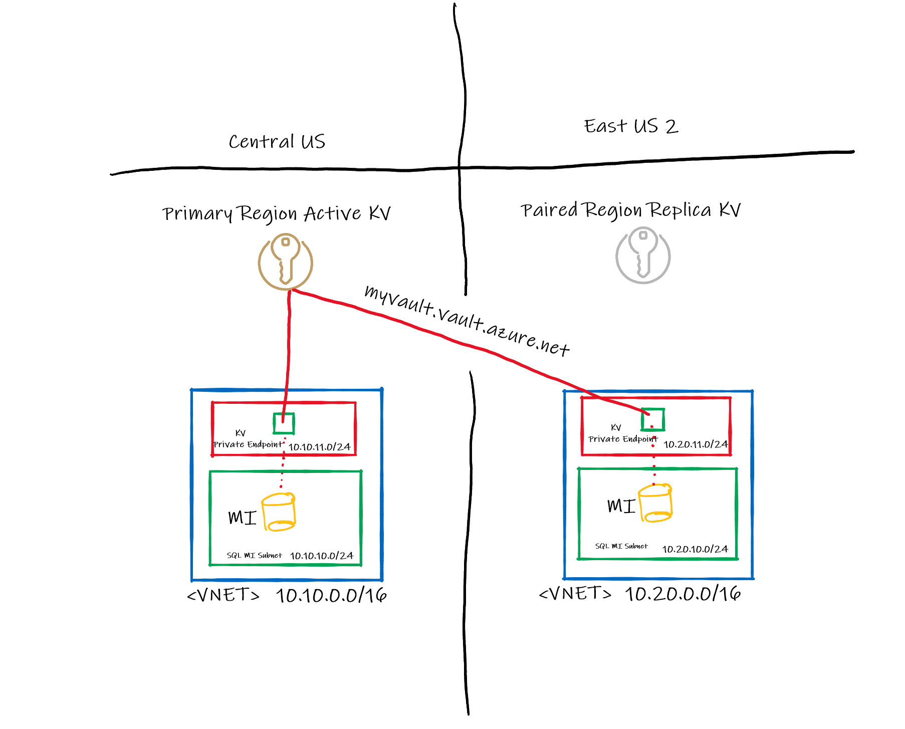

Geo-Failover AKV

## 1. Introduction
SQL Managed Instance (SQL MI) provides a SQL database with near 100% compatibility with the latest version of SQL Server Enterprise Edition. Many organizations choose SQL MI because of that compatibility, its ability to be deployed into a VNET, its built-in high availability, and because there are no virtual machines or operating systems to manage. The architecture described in this article will present a few common scenarios of highly available SQL Managed Instance deployment with geo-replication and customer-managed TDE keys as well as Private Endpoint enabled for Key Vault.

## 2. What is TDE?
Before we dive into the design, it's important to understand some of the components that make this possible. There are a number of things that are recommended when designing a secure system. One important practice is to encrypt your database. This ensures that if a malicious party walks off with a physical device with your data on it, the data on that device cannot be read without the certificates used to encrypt them. Transparent Data Encryption (TDE) does real-time I/O encryption / decryption of data and log files of a SQL Server database. TDE protects data at rest as opposed to across communication channels (in flight). Click [here](https://docs.microsoft.com/en-us/sql/relational-databases/security/encryption/transparent-data-encryption?view=azuresqldb-mi-current) to read more about how TDE works, specifically with SQL MI.

There are two different types of keys used for TDE: The DEK (Database Encryption Key) and the KEK (Key Encryption Key). The DEK is a symmetric key that lives on the server and the KEK is an asymmetric key which resides in Key Vault. In SQL MI, you have no control over the DEK so we'll be focusing on the KEK only. There are two options When customers want to use TDE: Customer-Managed keys (CMK) or Service-Managed keys. If you decide to go with CMK, [Azure Key Vault](https://docs.microsoft.com/en-us/azure/key-vault/general/overview) is required to securely store the keys required by TDE.

## 3. Architecture Overview
SQL MI will be deployed in two regions: a primary region and a secondary region. Microsoft recommends using [paired regions](https://docs.microsoft.com/en-us/azure/best-practices-availability-paired-regions#what-are-paired-regions) as it will [significantly improve replication performance](https://docs.microsoft.com/en-us/azure/azure-sql/database/auto-failover-group-overview?tabs=azure-powershell#using-geo-paired-regions) but many times, that is not the best option for your business. I will go over a few common scenarios further down.

### Geo-Replication
In all the below scenarios, we will be using [fail over groups and geo-replication](https://docs.microsoft.com/en-us/azure/azure-sql/database/auto-failover-group-overview?tabs=azure-powershell). With SQL MI, you can create failover groups and add your primary and secondary Managed Instances to that failover group. Again, Microsoft recommends using [paired regions](https://docs.microsoft.com/en-us/azure/best-practices-availability-paired-regions#what-are-paired-regions) for performance reasons.

When using geo-replication, your primary and secondary(s) will likely be in different regions. Considering that, and also adding customer-managed TDE keys, you now have to carefully plan how you will integrate Azure Key Vault as part of your geo/DR strategy. How and where you [create your TDE keys](https://docs.microsoft.com/en-us/sql/relational-databases/security/encryption/setup-steps-for-extensible-key-management-using-the-azure-key-vault?view=azuresqldb-mi-current&tabs=portal) will make a big difference in your design. Using service-managed keys makes life simple (and I will always argue that this is the option that you should go with) but some organizations require or insist  that they manage the keys themselves. If you've already decided to use CMK, here are a few common scenarios:

### Generate the TDE keys in Azure Key Vault.
If you generate the TDE keys in Key Vault, they can't be exported. This is great for security but makes things very inconvenient as I'll explain. Suppose you have your primary instance in Central US and your secondary in East US 2 like below. If you generated the keys in the Key Vault in Central US and you can't export it, how will you get the keys to the vault in East US 2? Well, here are your options:

1. Use the backup / restore feature in Key Vault to move the contents from one vault to another. This option [has some limitations](https://docs.microsoft.com/en-us/azure/key-vault/general/backup?tabs=azure-cli#design-considerations). You can only restore in Azure, on a KV in the same geography, and the same subscription. If you're planning on staying within the geography (your primary and seconaries are all in the same geo), I would recommend this approach if you're planning on going active/active. The benefit of this approach is that your SQL Instance won't have to reach across to another region for its TDE keys. The downside of this approach is that you have to jockey keys around yourself, which adds extra complexities during key [rotation](https://docs.microsoft.com/en-us/azure/azure-sql/database/transparent-data-encryption-byok-key-rotation?tabs=azure-powershell). Please note that if you do generate the keys in Key Vault, make sure you back them up and store the backup in another subscription or on-premises. Losing your TDE KEK could be disastrous.

2. You don't. This option also has its limitations. If you do nothing, your keys will stay put in the single Key Vault, but that might not be as bad as it sounds. Azure Key Vault, behind the scenes, [replicates itself to a paired region](https://docs.microsoft.com/en-us/azure/key-vault/general/disaster-recovery-guidance). This means that if Central US was broken beyond repair, Microsoft would fail over resources that take advantage of paired region data replication, such as Key Vault or Blob Storage. While this fail over process [takes ~20 minutes](source), I would argue if you have a primary and only one secondary in an active/passive configuration and they are in paired regions, this is your best option. In this scenario, your secondary instance would point to the vault in the primary region. There used to be a restriction that prevented MI from using TDE keys in a vault in another region but that as [since been lifted](source). If you choose to use private endpoints for Key Vault, you should create the endpoint in the same region as SQL MI as depicted below.

If you have the secondary instance connect to the private endpoint in the primary region, that connection will be lost when a [region fail over](source) occurs and will not come back because [private endpoint does not fail over](source), that's why creating the private endpoint in the secondary region is important. After ~20 minutes, the private endpoint in the secondary region will pick the connection back up to the key vault which will now be in East US 2 instead of Central US. Even though Key Vault is replicated, I still highly recommend backing up your Key Vault after every update and saving that to an [immutable blob](source). You can still accidentally delete your entire vault or resource group so don't solely rely on the infastructure. Also note that if you delete your key in the primary region, that deletion will replicate over. If you're planning on rotating your encryption keys, as you should, having a single key vault where your key was created is the easiest way to do periodic key rotation. Note that if you were using service-managed keys, Microsoft [periodically and seamlessly rotates the TDE keys](source).

### Generate the TDE keys in a supported HSM
If you have an on-premises HSM and it's [supported by Key Vault](https://docs.microsoft.com/en-us/azure/key-vault/keys/hsm-protected-keys-byok#supported-hsms), you can import your keys into Key Vault using a [BYOK utility](source) provided by your HSM vendor. For example, [here is where you can find Thales' BYOK utility](https://supportportal.thalesgroup.com/csm?id=kb_article_view&sys_kb_id=3892db6ddb8fc45005c9143b0b961987&sysparm_article=KB0021016) for Azure. This option is the most secure and very flexible. When the keys are generated either in Key Vault or your HSM, no human ever gets to see the private key. However, unlike Key Vault, HSM transfers don't have the same restrictions. In this scenario, I would recommend having a key vault in both regions and use the BYOK tool provided by your HSM vendor to transfer keys to all your vaults. A region fail over event would have no relevance here. I would take this a step further for even more availability by having each SQL MI point to the vault in its pairs region as a backup. If for whatever reason, SQL is unable to retrieve the TDE key from Key Vault, after 10 minutes, it will attempt to retrieve the key from the backup vault. If there is no backup vault and the 10 minutes has surpassed, SQL marks the databases as inaccessible. This is the design I would go with to be able to peacefully sleep at night. Just make sure you back up your HSM.

### Generate the TDE keys using openssl.
If you don't want your keys stuck in Key Vault or your HSM, you could generate them yourself on your laptop using OpenSSL and import them into Key Vault. This will give you the most flexibilty because you don't have to worry about having a supported HSM or work around Key Vault's backup and restore restrictions. This is the least secure and may not meet some security requirements. When you create your keys with OpenSSL, you are given a private key and there is potential that it could get leaked. If you decide to go with this method, I would still recommend the [mesh key vault configuration](source).

### You don't have to use paired regions 
If your primary is in Central US but your secondary is in West Europe, you can still have geo failover groups but there are [performance issues related to replication](source). There are also additional complexities when using the ["create your keys in KV" method](#generate-the-tde-keys-in-azure-key-vault). Key Vault is going to replicate to a paired region regardless of where you put your secondary sql instance. If you want each SQL Instance to use a vault in its region, it can be done:
1. Create the key in a vault in your primary region.
2. Create a 2nd vault in your primary region.
3. Backup and restore the key to that 2nd vault you just created.
4. Move that 2nd vault to West Europe.
5. Point secondary instance to that vault.