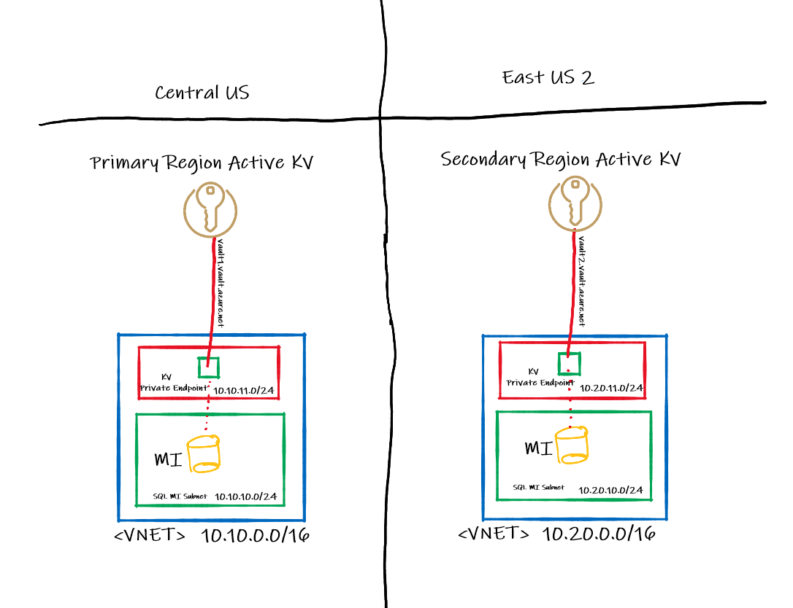

Geo-Failover AKV

## 1. Introduction
SQL Managed Instance (SQL MI) provides a SQL database with near 100% compatibility with the latest version of SQL Server Enterprise Edition. Many organizations choose SQL MI because of that compatibility, its ability to be deployed into a VNET, its built-in high availability, and because there are no virtual machines or operating systems to manage. The architecture described in this article will present a highly available SQL Managed Instance deployment with geo-replication and customer-managed TDE keys as well as Private Endpoint enabled for Key Vault.

## 2. What is TDE?
Before we dive into the design, it's important to understand some of the components that make this possible. There are a number of things that are recommended when designing a secure system. One important practice is to encrypt your database. This ensures that if a malicious party steals a physical device with your data on it, the data on that device cannot be read without the certificates used to encrypt them. Transparent Data Encryption (TDE) does real-time I/O encryption / decryption of data and log files of a SQL Server database. TDE protects data at rest as opposed to across communication channels (in flight). Click [here](https://docs.microsoft.com/en-us/sql/relational-databases/security/encryption/transparent-data-encryption?view=azuresqldb-mi-current) to read more about how TDE works, specifically with SQL MI.

There are two different types of keys used for TDE: The DEK (Database Encryption Key) and the KEK (Key Encryption Key). The DEK is on the server and the KEK is in Key Vault. In SQL MI, you have no control over the DEK so we'll be focusing on the KEK only. There are two options When customers want to manage their own TDE keys: Customer-Managed keys (CMK) or Microsoft-Managed. if you decide to go with CMK, [Azure Key Vault](https://docs.microsoft.com/en-us/azure/key-vault/general/overview) is required to securely stores secrets and keys required by TDE.

## 3. Architecture Overview
SQL MI will be deployed in a primary region and a secondary region. Microsoft recommends using [paired regions](https://docs.microsoft.com/en-us/azure/best-practices-availability-paired-regions#what-are-paired-regions) as it will [significantly improve replication performance](https://docs.microsoft.com/en-us/azure/azure-sql/database/auto-failover-group-overview?tabs=azure-powershell#using-geo-paired-regions) but many times, that is not the best option for your business. I will go over a few common scenarios below.

### Geo-Replication
In all the below scenarios, we will be using [fail over groups and geo-replication](https://docs.microsoft.com/en-us/azure/azure-sql/database/auto-failover-group-overview?tabs=azure-powershell).  With SQL MI, you can create failover groups and add your primary and secondary Managed Instances to that failover group. Microsoft recommends using [paired regions](https://docs.microsoft.com/en-us/azure/best-practices-availability-paired-regions#what-are-paired-regions) for performance reasons.

When using geo-replication, your primary and secondary(s) could be in different regions. Couple that with customer-managed TDE keys, you now have to consider Azure Key Vault as part of your geo/DR strategy. How and where you create your TDE keys will make a big difference in your design. Using service-managed keys makes life simple but some organizations require keys to be managed by them. If you're going CMK, here are a few common scenarios:

#### Generate the TDE keys in Azure Key Vault.
If you generate the TDE keys in Key Vault, they can't be exported. This is great for security but makes things very inconvenient. Suppose you have your primary instance in Central US and your secondary in East US 2 like below. If you generated the keys in the Key Vault in Central US and you can't export it, how will you get the keys to the vault in East US 2? 
- Use the backup / restore feature in Key Vault to move the contents from one vault to another. This option has some [limitations](https://docs.microsoft.com/en-us/azure/key-vault/general/backup?tabs=azure-cli#design-considerations). You can only restore in Azure, on a KV in the same geography, and the same subscription.

2. You don't. 

2. Generate the TDE keys in a supported HSM.
3. Generate the TDE keys using openssl.

### Dual Vault
You will also need to deploy Azure Key Vault. This is a PaaS service so it gets deployed with a public IP address. Like most organizations, you probably want to restrict access to public IPs as much as possible. This can be done using Private Link / Private Endpoint. The design approach on Microsoft's website has a Key Vault in each region so that the primary SQL instance obtains its keys from the vault in its region and same with the secondary.

### Single Key Vault
Another approach, which I personally prefer is to only have a vault in primary region. You should have a private endpoint for that single vault in both regions, like this:

## TDE Key Rotation

## Pros and Cons to each approach
Single Vault
##### pros:
- One of biggest benefits to this approach, in my opionion is not having to manage keeping keys in sync in both Key Vaults, which is necessary if you have more than one. There is no built-in mechanism for doing this. You would have to write your own orchestration using another system (Azure Automation, Functions, Logic Apps, etc.).
- Another benefit is not having to pay for multiple Key Vaults.

##### cons:
- Only Microsoft is in charge of when Key Vault fails over. The customer has no control of this. In other words, if for some reason your Key Vault is inaccessible and Microsoft decides that the entire region is irrecoverable, they will flip to the paired region. There will likely be significant delay between the time your Key Vault goes down and it becomes available in the secondary region. Microsoft says the fail over process takes ~20 minutes but again, there is an unknown period of time between when your Key Vault is inaccessible and when Microsoft decides to fail over.
- If you decide you want to fail over SQL without a region failure, your Managed Instace will be reaching over to another region for its TDE keys.

Dual Vault
##### pros:
- You control when you want to fail over, not Microsoft. All you have to do is keep your Key Vaults in sync and you can fail SQL over without worrying about Key Vault.

##### cons:
- You are responsible for keeping keys synchronized between the two vaults. This will require some minor scripting and an orchestration engine such as Azure Pipelines, Logic Apps, Azure Functions, etc. to run this script. 